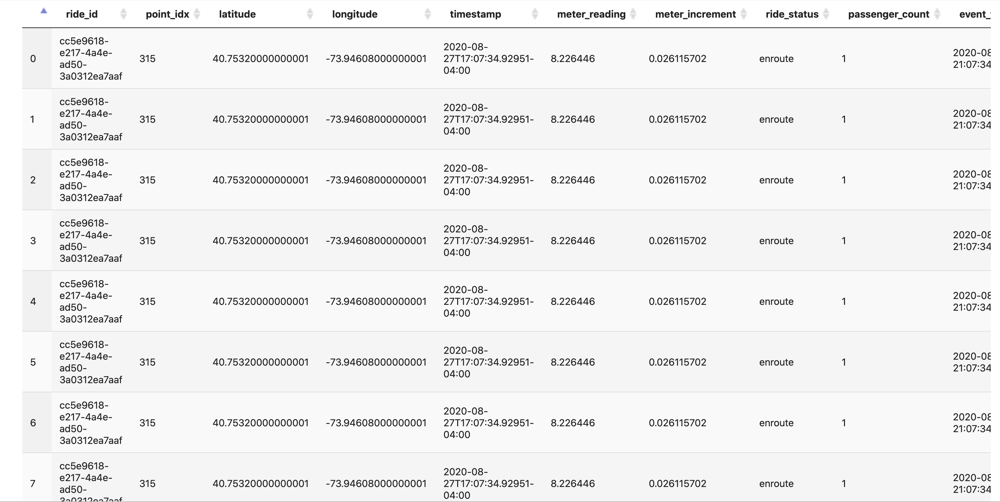
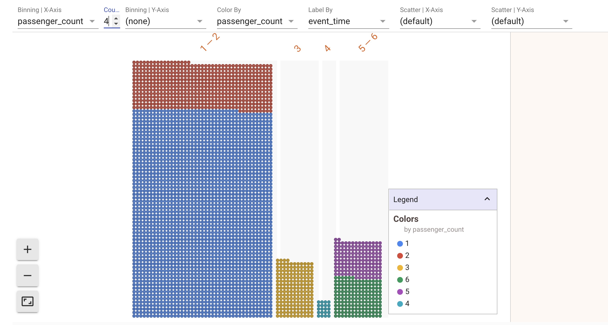
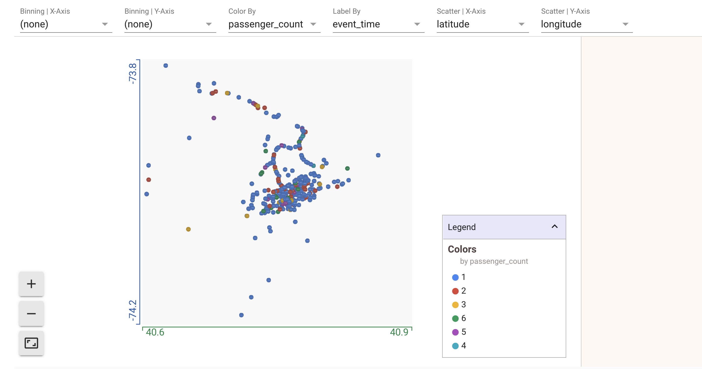
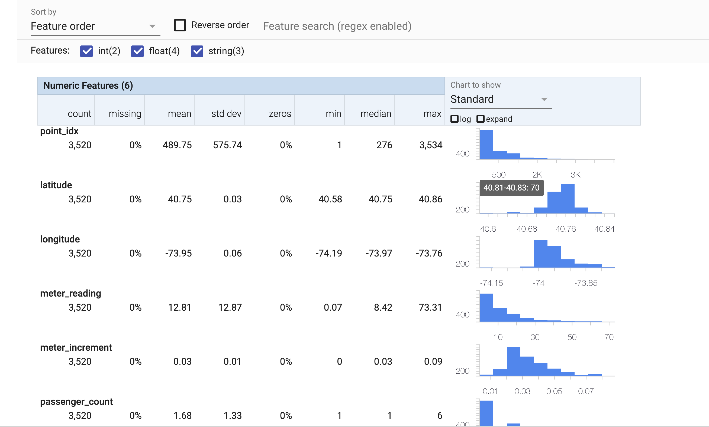
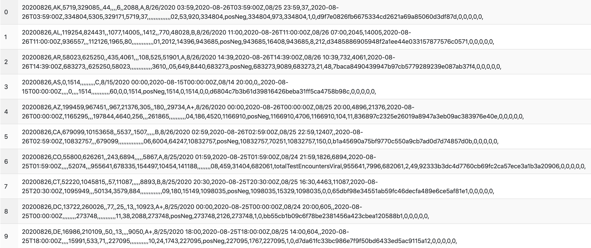

# Frequently Asked Questions

1. [Why can't I see some of the outputs saved in the notebook on Github, nbviewer or even in JupyterLab?](#q1)
2. [How do I install dependencies? I've installed my favorite Python library but the notebook still says `ModuleNotFoundError`.](#q2)
3. [How do I read the visualization?](#q3)
4. [Why the dataframe returned from `collect` is not in the schema that I've expected?](#q4)


## <a name="q1"></a>1. Why can't I see some of the outputs saved in the notebook on `Github`, `nbviewer` or even in `JupyterLab`?

Your outputs contain scripts and the `ipynb` file needs to be **trusted** so that scripts in it can be executed. To view outputs of a shared notebook, the easiest way is to explicitly trust a notebook: execute `jupyter trust path/to/ipynb/file` from the command line and re-open the notebook in `JupyterLab`.

`Github` preview and `nbviewer` will not execute any script in the saved notebook files. `JupyterLab` or `Jupyter Notebook` also do not trust notebooks copied from other places. The only notebooks they trust are notebooks created or executed locally with a signed signature in a local jupyter database.

### Other options

- Share notebooks through [Colab](https://colab.research.google.com/) or `ipynb` file in `Google Drive`. The sandbox environment in `Colab` always executes scripts since it's more secure.
- Share the notebook instance/runtime directly. With [Dataflow Notebooks](https://cloud.google.com/dataflow/docs/guides/interactive-pipeline-development), multiple collaborators can access the same notebook instance at the same time.

## <a name="q2"></a>2. How do I install dependencies? I've installed my favorite Python library but the notebook still says `ModuleNotFoundError`.

It's possible that you have installed a Python dependency through `!pip install` and still see `ModuleNotFoundError` when executing a notebook. That's because with `!pip install`, the dependency is installed to the environment of the notebook runtime - `JupyterLab` instead of the environment of code execution - the `IPython` kernel.

To install Python dependencies used when executing a notebook, do a cell magic in the notebook: `%pip install <my_favorite_lib>`. You might need to restart the kernel after the installation.

To install dependencies used by the JupyterLab, do `!pip install <some_global_executable>` or `!jupyter labextension install <my_favorite_labextension>`. You might need to restart the JupyterLab for some installations to take effect.

Just remember, `%pip install` installs dependencies to the current kernel and is used to execute Python code in the notebook. While `!pip install` installs dependencies to the environment that is running the notebook runtime you are interacting with. They might be the same environment and they might not. If a notebook runtime, such as `Colab`, doesn't support `%pip install`, it normally means that it has a single environment for the runtime and kernel. In that case, `!pip install` also works.

## <a name="q3"></a>3. How do I read the visualization?

When you do `show(pcolls)`, it displays a paginated searchable and orderable datatable. By clicking the header of each column, you can order data rows in the table by that column. 

If the PCollection being visualized is from a streaming source recorded in real time, you would also see dynamic updating in the table. Your ordering, page and search states will be preserved during those updates.

Additionally, when `include_window_info=True` is provided, [windowing](https://beam.apache.org/documentation/programming-guide/#windowing) info of the data will be displayed as additional columns.

When `visualize_data=True` is provided, a [Facets](https://pair-code.github.io/facets/) visualization of the data will be displayed. It's a useful generalized visualization for arbitrary data set. You can quickly gain insight into the distribution of your data and dive into the data set with data binning and scatter plotting.

Take below New York taxi ride data for an example:



The first part of the [Facets](https://pair-code.github.io/facets/) visualization can look like this if colored by `passenger_count`:


The color difference with the legend is already telling you an idea about the passenger count distribution per taxi ride in New York. You can additionally bin the data by `passenger_count` and choose a binning count of 4. This makes the data categorization by `passenger_count` more obvious:



Additionally, you can bin the data by `windows`. Now you see how the distribution of `passenger_count` changes in New York by time window:


If you want to analyze the location of each ride relatively, do a scatter plot by setting `Scatter | X-Axis` as `latitude` and `Scatter | Y-Axis` as `longitude`:



The second part of the [Facets](https://pair-code.github.io/facets/) visualization can look like this:



Your data fields with digital values are analyzed as `numerical features` while other fields are analyzed as `categorical features`.

## <a name="q4"></a>4. Why the dataframe returned from `collect` is not in the schema that I've expected?

Because `Interactive Beam` doesn't understand your data. It tries its best to convert your data from materialized PCollection into a `pandas Dataframe` object so that it can be visualized or collected for further usage outside of a `Beam` pipeline execution. The conversion doesn't require your intervention and auto generates column names if abesent for the columns/fields in the data.

Columns with data deeply nested or iterable in variable lengths will not be flattened in the collected Dataframe. When visualized, they are simply converted to strings as categorical data.

To convert the data into your expected schema, you can give `Interactive Beam` more hints about the structure of your data and surface the data you are interested in by flattening nested fields.

Formatted data such as JSON objects are good structured sources when they are neither deeply nested nor variable in length for each data point. For data that are not columnized but formatted in fixed patterns, such as fixed-length arrays, `namedtuple` is recommended. An example to convert data read from csv files into schemed data:

Take data from [covidtracking.com](http://covidtracking.com) for an example. We can download one of the daily COVID tracking data for the United States. Each row of the data contains tracking information for a state. When you read from the csv file:

```python
pcoll = p | 'Read CSV' >> beam.io.ReadFromText(csv_file, skip_header_lines=1)
```

Each row is in a comma separated format with fixed length in columns:



You can then create a `namedtuple` using the headers of the csv file:

```python
from collections import namedtuple
from csv import reader

def read_headers(csv_file):
  with open(csv_file, 'r') as f:
    header_line = f.readline().strip()
  return next(reader([header_line]))

headers = read_headers(csv_file)
UsCovidData = namedtuple('UsCovidData', headers)

class UsCovidDataCsvReader(beam.DoFn):
  def __init__(self, schema):
    self._schema = schema
    
  def process(self, element):
    values = [int(val) if val.isdigit() else val for val in next(reader([element]))]
    return [self._schema(*values)]

pcoll_with_schema = pcoll | 'Parse' >> beam.ParDo(UsCovidDataCsvReader(UsCovidData))
```

Then each row is structured:

